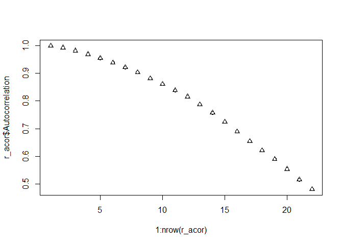

``` r
library(classwiseAcor)

data = internal$sampledata[,c("date", "id4")]

# Calculate via "r" method
r_acor = classwiseAcor::acor(
  data = data, 
  method = "r",
  dt = 30, 
  stop = 0.5
)
```

    ## [1] "acor_r()"
    ##    From  To Autocorrelation Number.of.instances
    ## 1     1  15       0.9986923              232522
    ## 2    15  45       0.9923781              493276
    ## 3    45  75       0.9813347              488998
    ## 4    75 105       0.9685157              485700
    ## 5   105 135       0.9542994              482764
    ## 6   135 165       0.9379595              478736
    ## 7   165 195       0.9211867              475862
    ## 8   195 225       0.9033882              474440
    ## 9   225 255       0.8814093              471348
    ## 10  255 285       0.8609154              468396
    ## 11  285 315       0.8382993              465140
    ## 12  315 345       0.8155012              462498
    ## 13  345 375       0.7873086              458864
    ## 14  375 405       0.7572492              455502
    ## 15  405 435       0.7250608              452110
    ## 16  435 465       0.6900212              448456
    ## 17  465 495       0.6546103              445342
    ## 18  495 525       0.6212728              441896
    ## 19  525 555       0.5905243              439394
    ## 20  555 585       0.5544390              436114
    ## 21  585 615       0.5159564              432906
    ## 22  615 645       0.4816220              431246

``` r
# Calculate via "c++" method
cpp_acor = classwiseAcor::acor(
  data = data, 
  method = "cpp",
  dt = 30, 
  stop = 0.5
)
```

    ## [1] "acor_cpp()"
    ##    From  To Autocorrelation Number.of.instances
    ## 1     1  15       0.9986923              116261
    ## 2    15  45       0.9923781              246638
    ## 3    45  75       0.9813347              244499
    ## 4    75 105       0.9685157              242850
    ## 5   105 135       0.9542994              241382
    ## 6   135 165       0.9379595              239368
    ## 7   165 195       0.9211867              237931
    ## 8   195 225       0.9033882              237220
    ## 9   225 255       0.8814093              235674
    ## 10  255 285       0.8609154              234198
    ## 11  285 315       0.8382993              232570
    ## 12  315 345       0.8155012              231249
    ## 13  345 375       0.7873086              229432
    ## 14  375 405       0.7572492              227751
    ## 15  405 435       0.7250608              226055
    ## 16  435 465       0.6900212              224228
    ## 17  465 495       0.6546103              222671
    ## 18  495 525       0.6212728              220948
    ## 19  525 555       0.5905243              219697
    ## 20  555 585       0.5544390              218057
    ## 21  585 615       0.5159564              216453
    ## 22  615 645       0.4816220              215623

``` r
# Plot definition
plot_acor = function(r_acor, cpp_acor) {
  plot(x = 1:nrow(r_acor), y = r_acor$Autocorrelation)
  points(x = 1:nrow(cpp_acor), y = cpp_acor$Autocorrelation, pch = 2)
}

# Make a plot
plot_acor(r_acor, cpp_acor)
```


